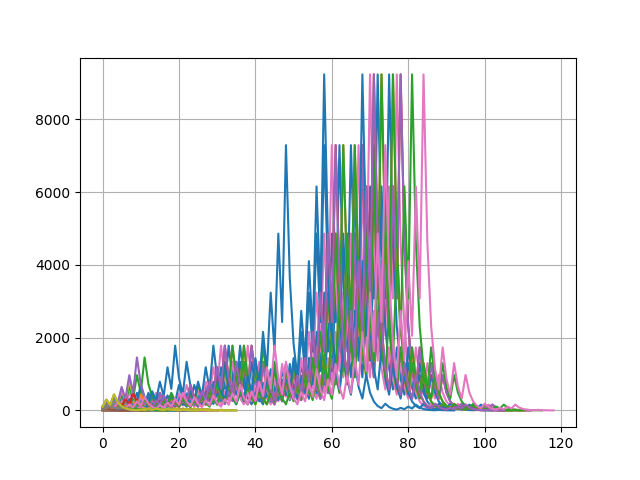

## Step 1: Machine Learning: Supervised Learning

We have noisy observations of a dynamical system and we are interested in best fitting, in some sense, these observations with another observation, related to the same observed system.

## Step 2: Convex Optimization

The estimated targets are part of a pipeline sending them to a convex optimizer which returns a fitness different from your fitness. You cannot modify the convex optimizer.

## Step 3 Convex Optimizer-in-the-loop backpropagation

You can use backpropagation to train your model against the post-optimizer fitness.

## Bonus Problem

Award for this problem: 1M dollars. Good luck

# References
